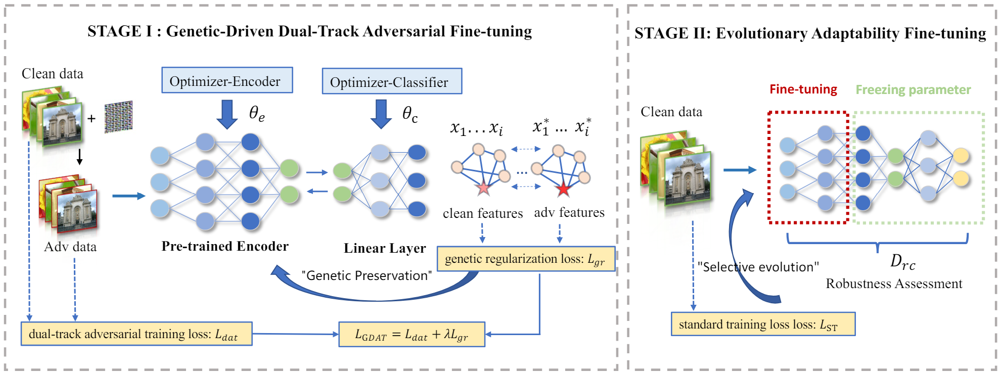

# Gen-AF

The implementation of our IEEE S&P 2024 paper "Securely Fine-tuning Pre-trained Encoders Against Adversarial Examples".


## Abstract

With the evolution of self-supervised learning, the pre-training paradigm has emerged as a predominant solution within the deep learning landscape. Model providers furnish pre-trained encoders designed to function as versatile feature extractors, enabling downstream users to harness the benefits of expansive models with minimal effort through fine-tuning.
Nevertheless, recent works have exposed a vulnerability in pre-trained encoders, highlighting their susceptibility to downstream-agnostic adversarial examples (DAEs) meticulously crafted by attackers. The lingering question pertains to the feasibility of fortifying the robustness of downstream models against DAEs, particularly in scenarios where the pre-trained encoders are publicly accessible to the attackers.

In this paper, we initially delve into existing defensive mechanisms against adversarial examples within the pre-training paradigm. Our findings reveal that the failure of current defenses stems from the domain shift between pre-training data and downstream tasks, as well as the sensitivity of encoder parameters. In response to these challenges, we propose Genetic Evolution-Nurtured Adversarial Fine-tuning (Gen-AF), a two-stage adversarial fine-tuning approach aimed at enhancing the robustness of downstream models. Gen-AF employs a genetic-directed dual-track adversarial fine-tuning strategy in its first stage to effectively inherit the pre-trained encoder. This involves optimizing the pre-trained encoder and classifier separately while incorporating genetic regularization to preserve the model's topology. In the second stage, Gen-AF assesses the robust sensitivity of each layer and creates a dictionary, based on which the top-k robust redundant layers are selected  with the remaining layers held fixed. Upon this foundation, we conduct evolutionary adaptability fine-tuning to further enhance the model's generalizability. Our extensive experiments, conducted across ten self-supervised training methods and six datasets, demonstrate that Gen-AF attains high testing accuracy and robust testing accuracy against state-of-the-art DAEs. 




## Latest Update
**2024/6/28**   We have released the official implementation code.

## Setup
- **Get code**
```shell 
git clone https://github.com/CGCL-codes/Gen-AF.git
```

- **Build environment**
```shell
cd Gen-AF
# use anaconda to build environment 
conda create -n Gen-Af python=3.8
conda activate Gen-Af
# install packages
pip install -r requirements.txt
```
- **The final project should be like this:**
    ```shell
    Gen-AF
    └- utils
        └- predict
    └- model
        └- linear.py
    └- data
    └- victims
        └- cifar10 (pre-training dataset)
          └- simclr
             └- simclr-cifar10-b30xch14-ep=999.ckpt
             └- clean_model
    └- output
    └- ...
    ```

- **Download Victim Pre-trained Encoders**
  - All of our pre-trained encoders were obtained from the [solo-learn](https://github.com/vturrisi/solo-learn)  repository, and some missing pre-trained encoders were trained by us based on their code.
  - Please move the downloaded pre-trained encoder into  /victims/[pre-dataset]/[method].


### CIFAR-10

| Method       | Backbone | Epochs | Acc@1 | Acc@5 | Checkpoint |
|--------------|:--------:|:------:|:--------------:|:--------------:|:----------:|
| BYOL         | ResNet18 |  1000  |  92.58     |     99.79      | [Link](https://drive.google.com/drive/folders/1KxeYAEE7Ev9kdFFhXWkPZhG-ya3_UwGP?usp=sharing) |
| DINO         | ResNet18 |  1000  |  89.52     |     99.71      | [Link](https://drive.google.com/drive/folders/1vyqZKUyP8sQyEyf2cqonxlGMbQC-D1Gi?usp=sharing) |
| MoCo V2+     | ResNet18 |  1000  |  92.94     |     99.79      | [Link](https://drive.google.com/drive/folders/1ruNFEB3F-Otxv2Y0p62wrjA4v5Fr2cKC?usp=sharing) |
| MoCo V3      | ResNet18 |  1000  |  93.10     |     99.80      | [Link](https://drive.google.com/drive/folders/1KwZTshNEpmqnYJcmyYPvfIJ_DNwqtAVj?usp=sharing) |
| NNCLR        | ResNet18 |  1000  |  91.88     |     99.78      | [Link](https://drive.google.com/drive/folders/1xdCzhvRehPmxinphuiZqFlfBwfwWDcLh?usp=sharing) |
| ReSSL        | ResNet18 |  1000  |  90.63     |     99.62      | [Link](https://drive.google.com/drive/folders/1jrFcztY2eO_fG98xPshqOD15pDIhLXp-?usp=sharing) |
| SimCLR       | ResNet18 |  1000  |  90.74     |     99.75      | [Link](https://drive.google.com/drive/folders/1mcvWr8P2WNJZ7TVpdLHA_Q91q4VK3y8O?usp=sharing) |
| SwAV         | ResNet18 |  1000  |  89.17     |     99.68      | [Link](https://drive.google.com/drive/folders/1nlJH4Ljm8-5fOIeAaKppQT6gtsmmW1T0?usp=sharing) |
| VIbCReg      | ResNet18 |  1000  |  91.18     |     99.74      | [Link](https://drive.google.com/drive/folders/1XvxUOnLPZlC_-OkeuO7VqXT7z9_tNVk7?usp=sharing) |
| W-MSE        | ResNet18 |  1000  |  88.67     |     99.68      | [Link](https://drive.google.com/drive/folders/1xPCiULzQ4JCmhrTsbxBp9S2jRZ01KiVM?usp=sharing) |


### ImageNet-100

| Method                  | Backbone | Epochs | Acc@1 | Acc@5| Checkpoint |
|-------------------------|:--------:|:------:|:--------------:|:---------------:|:----------:|
| BYOL        | ResNet18 |   400  | 80.16     |     95.02       |  [Link](https://drive.google.com/drive/folders/1riOLjMawD_znO4HYj8LBN2e1X4jXpDE1?usp=sharing) |
| DINO                    | ResNet18 |   400  | 74.84     |     92.92       | [Link](https://drive.google.com/drive/folders/1NtVvRj-tQJvrMxRlMtCJSAecQnYZYkqs?usp=sharing) |
| MoCo V2+    | ResNet18 |   400  | 78.20     |     95.50       |  [Link](https://drive.google.com/drive/folders/1ItYBtMJ23Yh-Rhrvwjm4w1waFfUGSoKX?usp=sharing) |
| MoCo V3     | ResNet18 |   400  | 80.36     |     95.18       |  [Link](https://drive.google.com/drive/folders/15J0JiZsQAsrQler8mbbio-desb_nVoD1?usp=sharing) |
| NNCLR       | ResNet18 |   400  | 79.80     |     95.28       |  [Link](https://drive.google.com/drive/folders/1QMkq8w3UsdcZmoNUIUPgfSCAZl_LSNjZ?usp=sharing) |
| ReSSL                   | ResNet18 |   400  | 76.92     |     94.20       |   [Link](https://drive.google.com/drive/folders/1urWIFACLont4GAduis6l0jcEbl080c9U?usp=sharing) |
| SimCLR      | ResNet18 |   400  | 77.64     |     94.06        |    [Link](https://drive.google.com/drive/folders/1yxAVKnc8Vf0tDfkixSB5mXe7dsA8Ll37?usp=sharing) |
| SwAV                    | ResNet18 |   400  | 74.04     |     92.70       |   [Link](https://drive.google.com/drive/folders/1VWCMM69sokzjVoPzPSLIsUy5S2Rrm1xJ?usp=sharing) |
| VIbCReg                 | ResNet18 |   400  | 79.86     |     94.98       |   [Link](https://drive.google.com/drive/folders/1Q06hH18usvRwj2P0bsmoCkjNUX_0syCK?usp=sharing) |
| W-MSE                   | ResNet18 |   400  | 67.60     |     90.94       |    [Link](https://drive.google.com/drive/folders/1TxubagNV4z5Qs7SqbBcyRHWGKevtFO5l?usp=sharing) |


## Quick Start
- **Adversarial Fine-tuning**
```shell 
python adversarial_fine-tuning.py
```
- **Standard Fine-tuning**
```shell 
python standard_fine-tuning.py
```

## BibTeX 
If you find Gen-AF both interesting and helpful, please consider citing us in your research or publications:
```bibtex
@inproceedings{zhou2024securely,
  title={Securely Fine-tuning Pre-trained Encoders Against Adversarial Examples},
  author={Zhou, Ziqi and Li, Minghui and Liu, Wei and Hu, Shengshan and Zhang, Yechao and Wan, Wei and Xue, Lulu and Zhang, Leo Yu and Yao, Dezhong and Jin, Hai},
  booktitle={Proceedings of the 2024 IEEE Symposium on Security and Privacy (SP'24)},
  year={2024}
}
```
